# Design Pattern

[design-patterns](https://refactoring.guru/design-patterns)

## 1.1 factory method

aka virtual constructor

Factory method plans to **replace** direct object construction calls with creation method calls within factory method. Note that products result from this factory methods must inherit common base class.

This is often the starting point of a design when you decouple object creator and its concrete implementation.

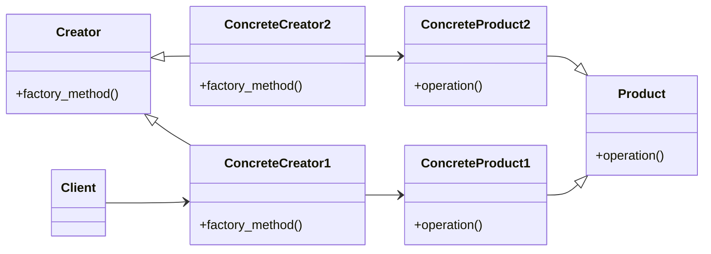

```python
from abc import ABC, abstractmethod

# define abstract
class Product(ABC):
    @abstractmethod
    def operation(self) -> str:
        pass

class Creator(ABC):
    @abstractmethod
    def factory_method(self):
        pass

# define concrete products
class ConcreteProduct1(Product):
    def operation(self) -> str:
        return "ConcreteProduct1"

class ConcreteProduct2(Product):
    def operation(self) -> str:
        return "ConcreteProduct2"

# define concrete creators
class ConcreteCreator1(Creator):
    def factory_method(self) -> Product:
        return ConcreteProduct1()

class ConcreteCreator2(Creator):
    def factory_method(self) -> Product:
        return ConcreteProduct2()

# client
class Client():
    def __init__(self, concrete_creator):
        self._creator = concrete_creator

def main():
    client1 = Client(ConcreteCreator1())
    client2 = Client(ConcreteCreator2())
```

## 1.2 abstract factory

**Abstract Factory** is an interface with a list of creation methods (factory methods) that return **abstract** product types.

For a particular color product, we define a new factory from abstract factory that returns product of particular color, ex. RedFactory for RedProductA and RedProductB.

Abstract factory specialize in creating families of related products.

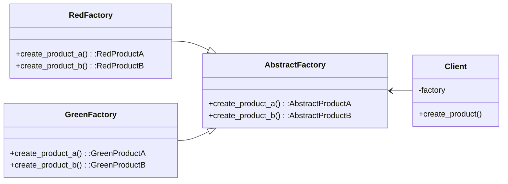

```python
from abc import ABC, abstractmethod
# define abstract
class AbstractProductA(ABC):
    @abstractmethod
    def f_a(self) -> str:
        pass

class AbstractProductB(ABC)from typing import *:
    @abstractmethod
    def f_b(self) -> str:
        pass

class AbstractFactory(ABC):
    @abstractmethod
    def create_product_a(self) -> AbstractProductA:
        pass

    @abstractmethod
    def create_product_b(self) -> AbstractProductB:
        pass

# define two concrete type: red and green
class RedProductA(AbstractProductA):
    def f_a(self) -> str:
        return 'red product a'

class RedProductB(AbstractProductB):
    def f_b(self) -> str:
        return 'red product b'

class RedFactory(AbstractFactory):
    def create_product_a(self) -> RedProductA:
        return RedProductA()

    def create_product_b(self) -> RedProductB:
        return RedProductB()

class GreenProductA(AbstractProductA):
    def f_a(self) -> str:
        return 'green product a2'

class GreenProductB(AbstractProductB):
    def f_b(self) -> str:
        return 'green product b2'

class GreenFactory(AbstractFactory):
    def create_product_a(self) -> GreenProductA:
        return GreenProductA()

    def create_product_b(self) -> GreenProductB:
        return GreenProductB()

# define client code
class Client():
    def __init__(self, factory):
        self._factory = factory

    def create_product(self):
        product_a = self._factory.create_product_a()
        product_b = self._factory.create_product_b()
        return product_a, product_b

def main():
    client = Client(RedFactory())
    client.create_product()

```

## 1.3 builder

A unified product class may have one _create_product_ method that accept various parameter. This could lead to very ugly construction calls.

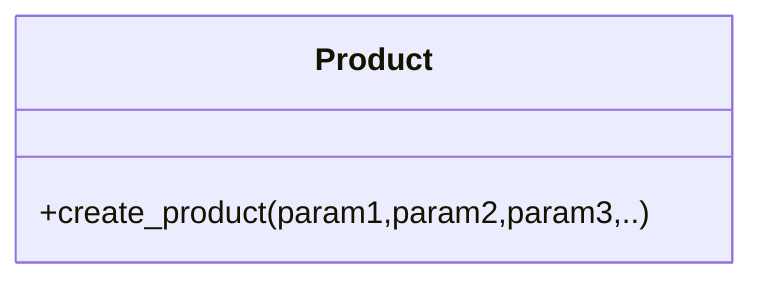

```python
Product().create_product(1,2,False,True,None,1)
Product().create_product(None,2,True,True,True,1)
```

**Builder** allows a step-by-step creation of objects.

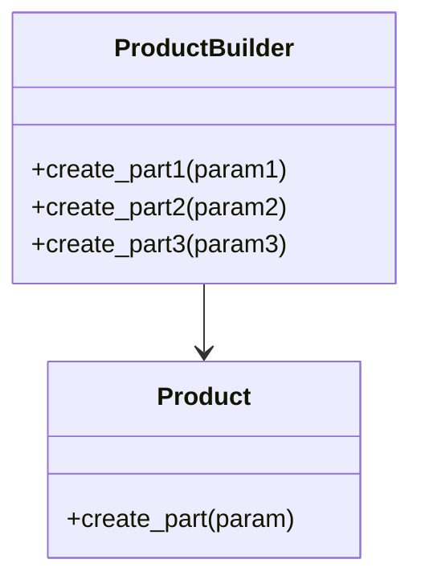

We can also add a **Director** class to orchestrate and diversify building steps of various products.

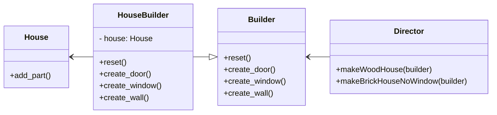

```python
from abc import ABC, abstractmethod

# define product
class House(ABC):
    @abstractmethod
    def add_part(self, part, num, material) -> None:
        pass

# define builder
class Builder(ABC):
    @abstractmethod
    def reset(self) -> None:
        pass

    @abstractmethod
    def create_door(self, num) -> None:
        pass

    @abstractmethod
    def create_window(self, num) -> None:
        pass

    @abstractmethod
    def create_wall(self, num, materal) -> None:
        pass

# define concreate builder
class HouseBuilder(Builder):
    def __init__(self) -> None:
        self.reset()

    def reset(self) -> None:
        self._house = House()

    def create_door(self, num) -> None:
        self._house.add_part('door', num, 'wood')

    def create_window(self, num) -> None:
        self._house.add_part('window', num, 'glass')

    def create_wall(self, num, material) -> None:
        self._house.add_part('wall', num, material)

    @property
    def house(self) -> House:
        return self._house

# define director
class Director():

    @property
    def builder(self) -> Builder:
        return self._builder

    @builder.setter
    def builder(self, builder: Builder) -> None:
        self._builder = builder

    def makeWoodHouse(self) -> None:
        self._builder.reset()
        self._builder.create_door(2)
        self._builder.create_window(2)
        self._builder.create_wall(4,'wood')

    def makeBrickHouseNoWindow(self) -> None:
        self._builder.reset()
        self._builder.create_door(2)
        self._builder.create_wall(4,'brick')

def main():
    director1 = Director()
    builder = HouseBuilder()
    director1.builder = builder

    director1.makeWoodHouse()
    house = builder.house

```

## 1.4 prototype

If an object offers a cloning method, it is a **Prototype**. Note the difference between shallow copy and deep copy.

```python
import copy

class Prototype():
    def __init__(self, nested_anything):
        self.nested_anything = nested_anything

    def __copy__(self):
        # create new object and inserts references from original
        nested_anything = copy.copy(self.nested_anything)

        new = self.__class__(nested_anything)
        # update writable attributes
        new.__dict__ = copy.copy(self.__dict__) # or use __dict__.update()

        return new

    def __deepcopy__(self, memo):
        # create new object and recursively insert copies
        nested_anything = copy.deepcopy(self.nested_anything, memo)

        new = self.__class__(nested_anything)
        new.__dict__ = copy.deepcopy(self.__dict__, memo)

        return new

```

## 1.5 singleton

Singleton pattern ensures that a class has only **one** instance and a global access point is provided. This is an antipattern sometimes though.

```python
# this is a thread-safe implementation
from threading import Lock

class Singleton():
    _instance = None
    _lock = Lock()

    def __new__(cls):
        # this could work, but acquiring a lock is expensive, so do it only when necessary
        #
        # with cls._lock:
        #     if _instance is None:
        #         cls._instance = super().new(cls)

        if cls._instance is None:
            with cls._lock:
                if cls._instance is None:
                    cls._instance = super().__new__(cls)
        return cls._instance

def main():
    assert Singleton() == Singleton()
```

## 2.1 adapter

Adapter converts data from one interface and feeds to another interface.

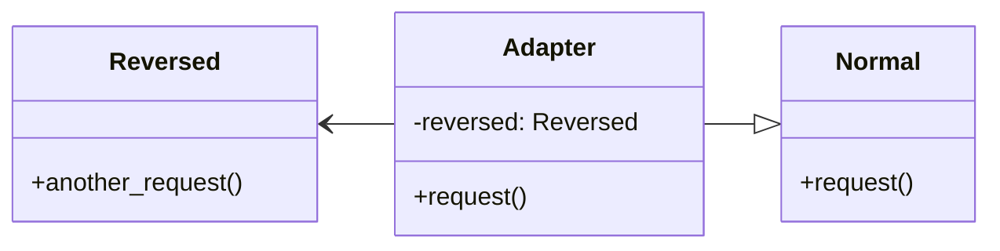

```python
from typing import *

# Normal and Reversed are incompatible

class Normal:
    def request(self) -> str:
        return "default"

class Reversed:
    def another_request(self) -> str:
        return "ruoivaheb"

class Adapter(Normal):
    def __init__(self, reversed: Reversed) -> None:
        # adaptee
        self._reversed = reversed

    def request(self) -> str:
        # convert
        ret = self._reversed.another_request()[::-1]

        return ret

def main():
    normal = Normal()
    print(normal.request())

    r = Reversed()
    adapter = Adapter(r)
    print(adapter.request())

```

## 2.2 bridge

Making a change to monolithic codebase is extremely hard. Bridge tends to break the whole into two parts: the **abstraction** and the **implementation**.

Abstraction itself doesn't do any work - it delegates everything to the implementation.

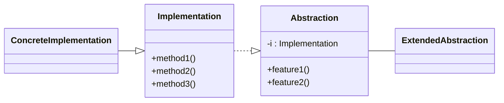

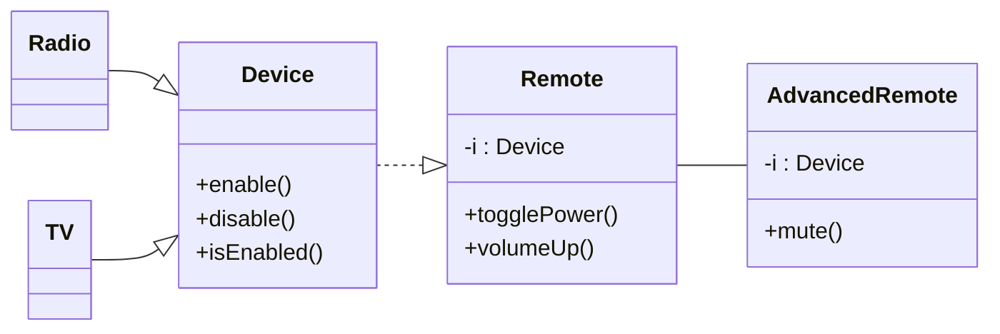

## 2.3 composite

Composite enable a tree-like object structure of a model. When being called upon, the model will passing down the hierachy to each level and execute accordingly.

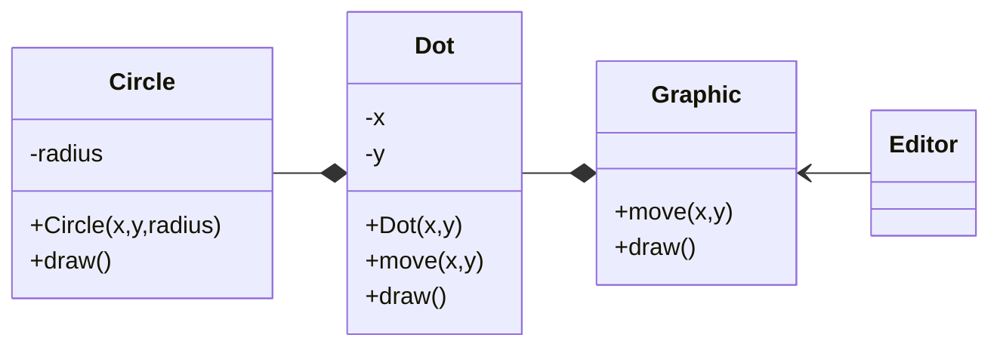

## 2.4 decorator

Decorator is basically a **wrapper**. When at runtime, extra behaviors are added without changing base code.

Decorator is used when it is not possible to use inheritance. It is a Composite with only one child.

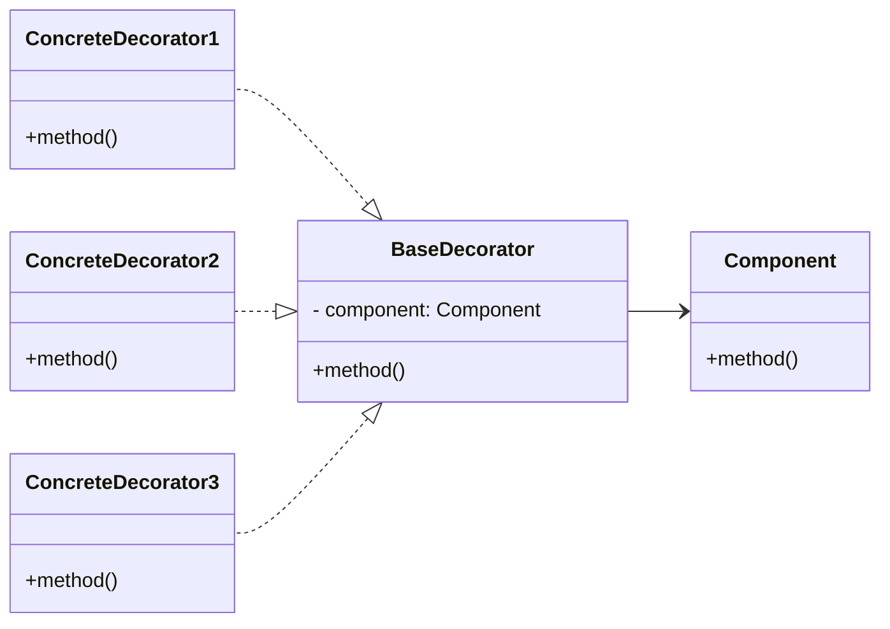

## 2.5 facade

Facade provides a simple interface in front of a complex subsystem.

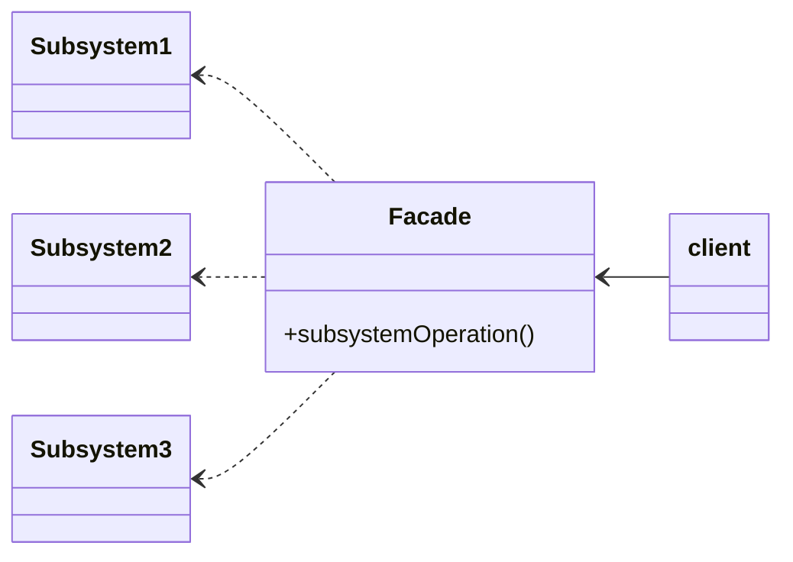

## 2.6 flyweight

Flyweight objects store only **immutable intrinsic** data inside. Mutable, contextual, extrinsic data are moved outside to methods that use flyweight objects.

- original

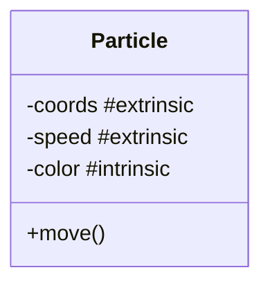

- flyweight version

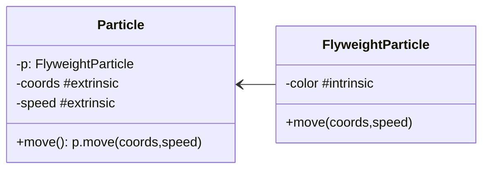

## 2.7 proxy

Proxy creates an interface with **same** functionality and allows introducing mechanisms such as lazy loading, caching, access control and logging.

```python
from abc import ABC, abstractmethod

class Subject(ABC):
    @abstractmethod
    def request(self) -> None:
        pass

class ConcreteSubject(Subject):
    def request(self) -> None:
        return True

class ProxySubject(Subject):
    def __init__(self, concrete_subject:ConcreteSubject):
        self._subject = concrete_subject

    def request(self):
        # lazy loading, caching
        # ...

        # access control
        if self.check_access():
            self._subject.request()

        # logging
        self.log_access()

    def check_access():
        return True

    def log_access():
        return

```

| pattern   | interface compared with original |
| --------- | -------------------------------- |
| adapter   | different                        |
| proxy     | same                             |
| decorator | enhanced                         |

## 3.1 chain of responsibility

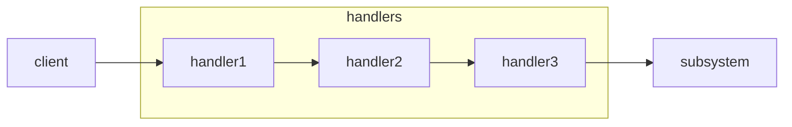

```python
from abc import ABC, abstractmethod
from typing import *

class BaseHandler(ABC):

    @abstractmethod
    def set_next(self, base_handler):
        pass

    @abstractmethod
    def handle(self, request):
        pass

class Handler(BaseHandler):

    def __init__(self):
        self._next_handler = None

    def set_next(self, handler):
        self._next_handler = handler
        return self._next_handler

    @abstractmethod
    def handle(self, request):
        if self._next_handler is not None:
            self._next_handler.handle(request)
        return

class Handler1(Handler):
    def handle(self, request):
        if request == 1:
            print('at handler 1')
            return
        else:
            # pass down
            return super().handle(request)

class Handler2(Handler):
    def handle(self, request):
        if request == 2:
            print('at handler 2')
            return
        else:
            # pass down
            return super().handle(request)

class Handler3(Handler):
    def handle(self, request):
        if request == 3:
            print('at handler 3')
            return
        else:
            # pass down
            return super().handle(request)

def client_code():
    h1 = Handler1()
    h2 = Handler2()
    h3 = Handler3()

    h1.set_next(h2).set_next(h3)
    h1.handle(1)
    h1.handle(2)
    h1.handle(3)
    h1.handle(4)
```

| pattern      | req & res relation               |
| ------------ | -------------------------------- |
| chain of res | sequantially passing             |
| command      | unidirectional                   |
| mediator     | commute indirectly via an object |
| observer     | receivers dynamically sub/unsub  |

## 3.2 command

Command pattern **wraps** requests into a command object, introducing a new layer between senders and receivers.

It is often used when implementing a reversable, schedulable operations.

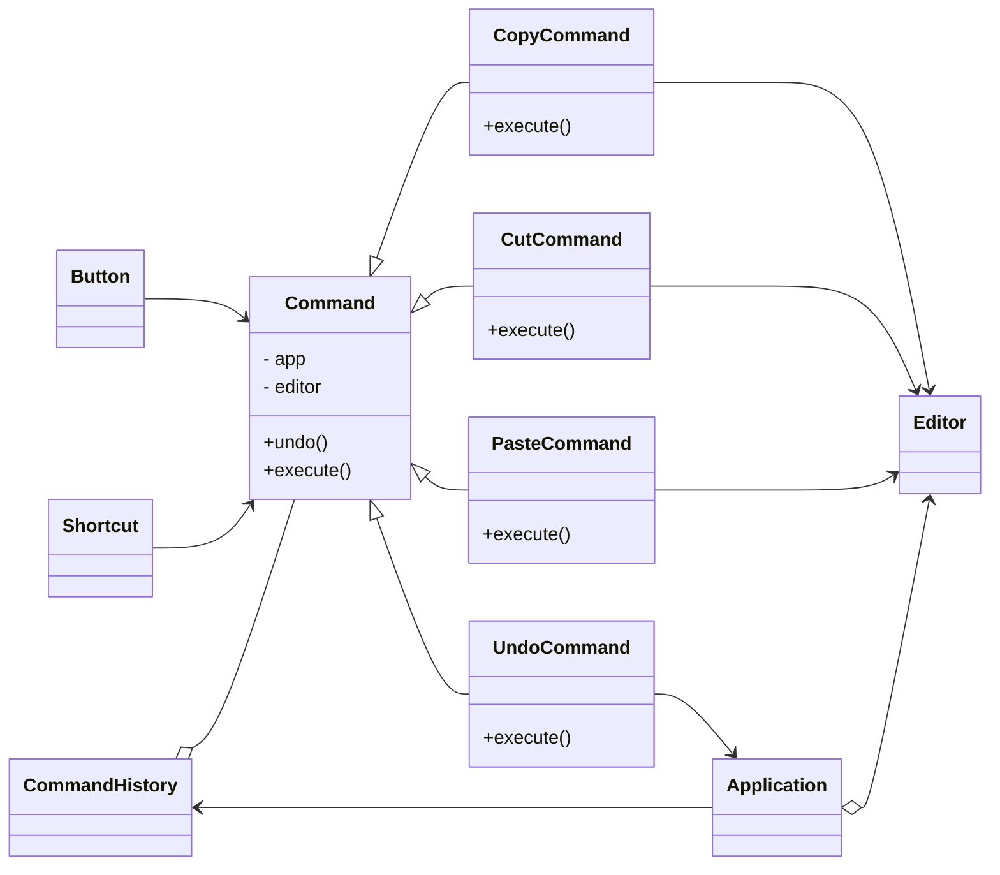

## 3.3 iterator

Iterator simple implements a traverse behaviour of a collection.

## 3.4 mediator

Mediator simplify object communications by forcing them to collaberate via only a mediator object.

The downside is over time a mediator might evolve into a god object.

## 3.5 memento

Memento pattern allows snapshot and restore previous state of an object.

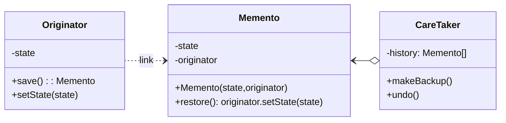

## 3.6 observer

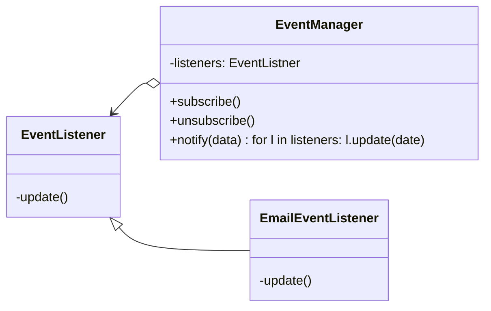

## 3.7 state

Relates to Finite-State Machine.

Create a context and a separate state object to manage methods

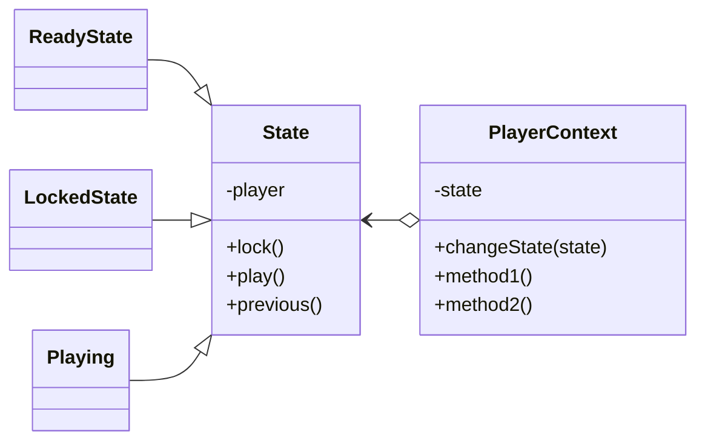

## 3.8 strategy

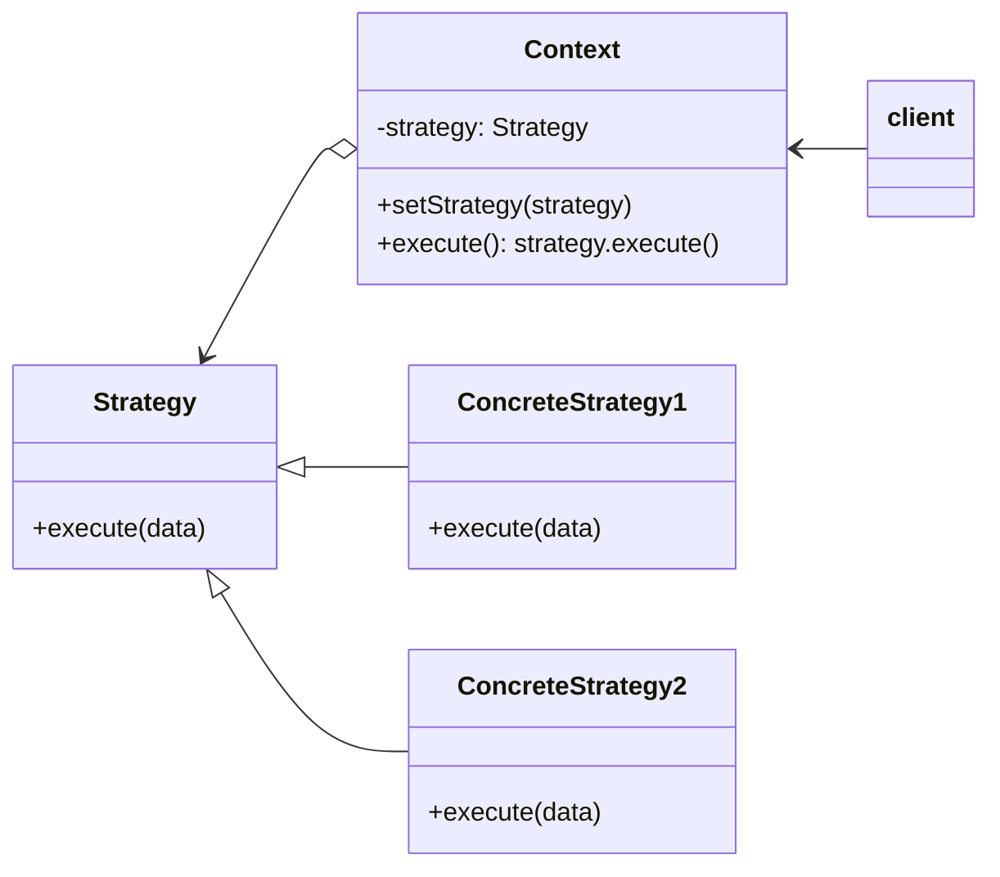

## 3.9 template method

## 3.10 visitor
