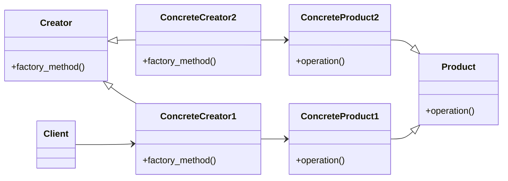

# factory method

aka virtual constructor

Factory method plans to **replace** direct object construction calls with creation method calls within factory method. Note that products result from this factory methods must inherit common base class.

This is often the starting point of a design when you decouple object creator and its concrete implementation.



```python
from abc import ABC, abstractmethod

# define abstract
class Product(ABC):
    @abstractmethod
    def operation(self) -> str:
        pass

class Creator(ABC):
    @abstractmethod
    def factory_method(self):
        pass

# define concrete products
class ConcreteProduct1(Product):
    def operation(self) -> str:
        return "ConcreteProduct1"

class ConcreteProduct2(Product):
    def operation(self) -> str:
        return "ConcreteProduct2"

# define concrete creators
class ConcreteCreator1(Creator):
    def factory_method(self) -> Product:
        return ConcreteProduct1()

class ConcreteCreator2(Creator):
    def factory_method(self) -> Product:
        return ConcreteProduct2()

# client
class Client():
    def __init__(self, concrete_creator):
        self._creator = concrete_creator

def main():
    client1 = Client(ConcreteCreator1())
    client2 = Client(ConcreteCreator2())
```
