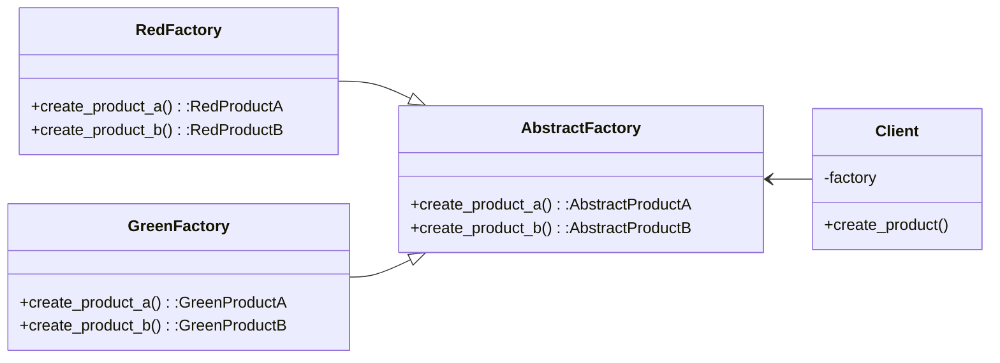

# abstract factory

**Abstract Factory** is an interface with a list of creation methods (factory methods) that return **abstract** product types.

For a particular color product, we define a new factory from abstract factory that returns product of particular color, ex. RedFactory for RedProductA and RedProductB.

Abstract factory specialize in creating families of related products.



```python
from abc import ABC, abstractmethod
# define abstract
class AbstractProductA(ABC):
    @abstractmethod
    def f_a(self) -> str:
        pass

class AbstractProductB(ABC)from typing import *:
    @abstractmethod
    def f_b(self) -> str:
        pass

class AbstractFactory(ABC):
    @abstractmethod
    def create_product_a(self) -> AbstractProductA:
        pass

    @abstractmethod
    def create_product_b(self) -> AbstractProductB:
        pass

# define two concrete type: red and green
class RedProductA(AbstractProductA):
    def f_a(self) -> str:
        return 'red product a'

class RedProductB(AbstractProductB):
    def f_b(self) -> str:
        return 'red product b'

class RedFactory(AbstractFactory):
    def create_product_a(self) -> RedProductA:
        return RedProductA()

    def create_product_b(self) -> RedProductB:
        return RedProductB()

class GreenProductA(AbstractProductA):
    def f_a(self) -> str:
        return 'green product a2'

class GreenProductB(AbstractProductB):
    def f_b(self) -> str:
        return 'green product b2'

class GreenFactory(AbstractFactory):
    def create_product_a(self) -> GreenProductA:
        return GreenProductA()

    def create_product_b(self) -> GreenProductB:
        return GreenProductB()

# define client code
class Client():
    def __init__(self, factory):
        self._factory = factory

    def create_product(self):
        product_a = self._factory.create_product_a()
        product_b = self._factory.create_product_b()
        return product_a, product_b

def main():
    client = Client(RedFactory())
    client.create_product()

```
