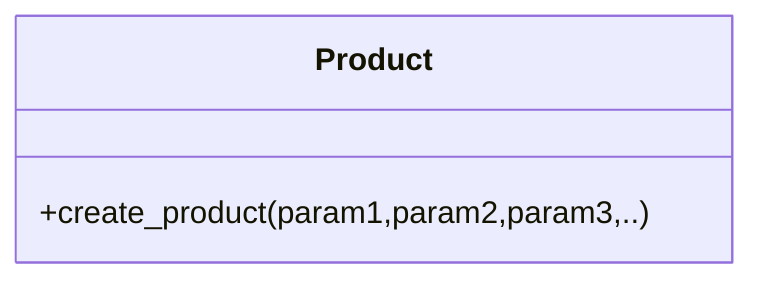
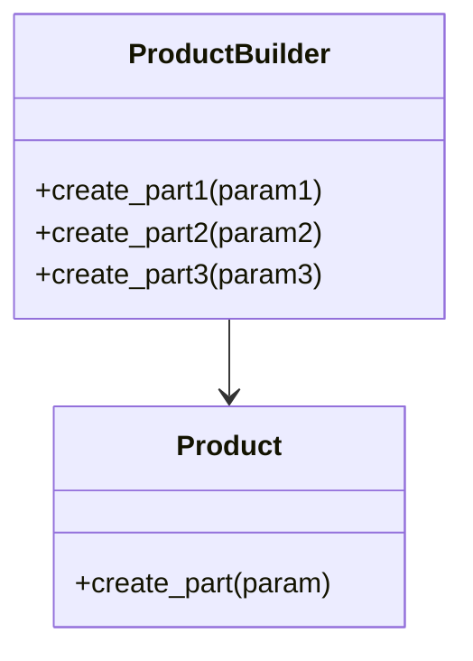
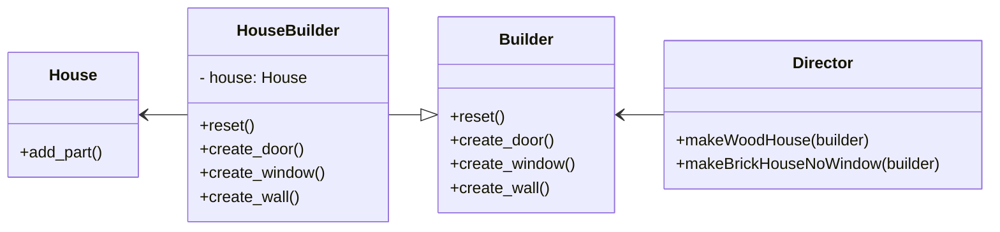

# builder

A unified product class may have one _create_product_ method that accept various parameter. This could lead to very ugly construction calls.



```python
Product().create_product(1,2,False,True,None,1)
Product().create_product(None,2,True,True,True,1)
```

**Builder** allows a step-by-step creation of objects.



We can also add a **Director** class to orchestrate and diversify building steps of various products.



```python
from abc import ABC, abstractmethod

# define product
class House(ABC):
    @abstractmethod
    def add_part(self, part, num, material) -> None:
        pass

# define builder
class Builder(ABC):
    @abstractmethod
    def reset(self) -> None:
        pass

    @abstractmethod
    def create_door(self, num) -> None:
        pass

    @abstractmethod
    def create_window(self, num) -> None:
        pass

    @abstractmethod
    def create_wall(self, num, materal) -> None:
        pass

# define concreate builder
class HouseBuilder(Builder):
    def __init__(self) -> None:
        self.reset()

    def reset(self) -> None:
        self._house = House()

    def create_door(self, num) -> None:
        self._house.add_part('door', num, 'wood')

    def create_window(self, num) -> None:
        self._house.add_part('window', num, 'glass')

    def create_wall(self, num, material) -> None:
        self._house.add_part('wall', num, material)

    @property
    def house(self) -> House:
        return self._house

# define director
class Director():

    @property
    def builder(self) -> Builder:
        return self._builder

    @builder.setter
    def builder(self, builder: Builder) -> None:
        self._builder = builder

    def makeWoodHouse(self) -> None:
        self._builder.reset()
        self._builder.create_door(2)
        self._builder.create_window(2)
        self._builder.create_wall(4,'wood')

    def makeBrickHouseNoWindow(self) -> None:
        self._builder.reset()
        self._builder.create_door(2)
        self._builder.create_wall(4,'brick')

def main():
    director1 = Director()
    builder = HouseBuilder()
    director1.builder = builder

    director1.makeWoodHouse()
    house = builder.house

```
