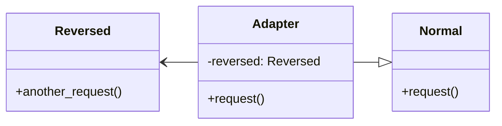

# adapter

Adapter converts data from one interface and feeds to another interface.



```python
from typing import *

# Normal and Reversed are incompatible

class Normal:
    def request(self) -> str:
        return "default"


class Reversed:
    def another_request(self) -> str:
        return "ruoivaheb"


class Adapter(Normal):
    def __init__(self, reversed: Reversed) -> None:
        # adaptee
        self._reversed = reversed

    def request(self) -> str:
        # convert
        ret = self._reversed.another_request()[::-1]

        return ret


def main():
    normal = Normal()
    print(normal.request())

    r = Reversed()
    adapter = Adapter(r)
    print(adapter.request())


```
