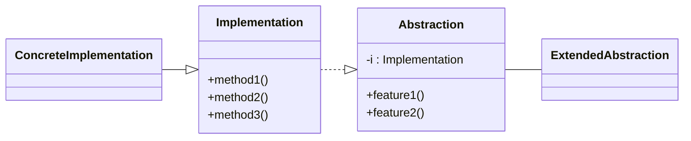
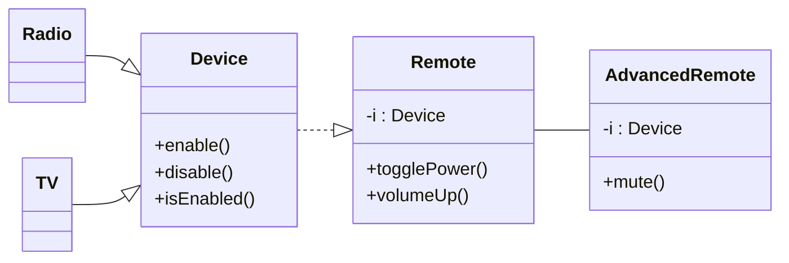

# bridge

Making a change to monolithic codebase is extremely hard. Bridge tends to break the whole into two parts: the **abstraction** and the **implementation**.

Abstraction itself doesn't do any work - it delegates everything to the implementation.

