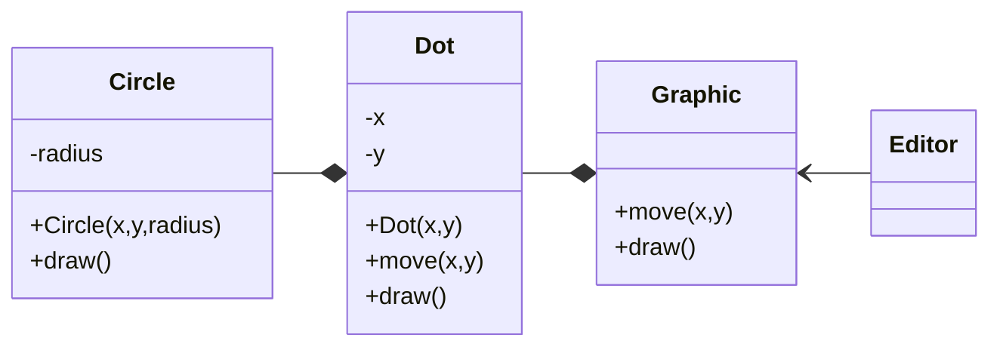

# composite

Composite enable a tree-like object structure of a model. When being called upon, the model will passing down the hierachy to each level and execute accordingly.

```mermaid
classDiagram
    direction RL
    Editor --> Graphic
    Graphic *-- Dot
    Dot *-- Circle
    class Graphic{
        +move(x,y)
        +draw()
    }
    class Dot{
        -x
        -y
        +Dot(x,y)
        +move(x,y)
        +draw()
    }
    class Circle{
        -radius
        +Circle(x,y,radius)
        +draw()
    }
```
