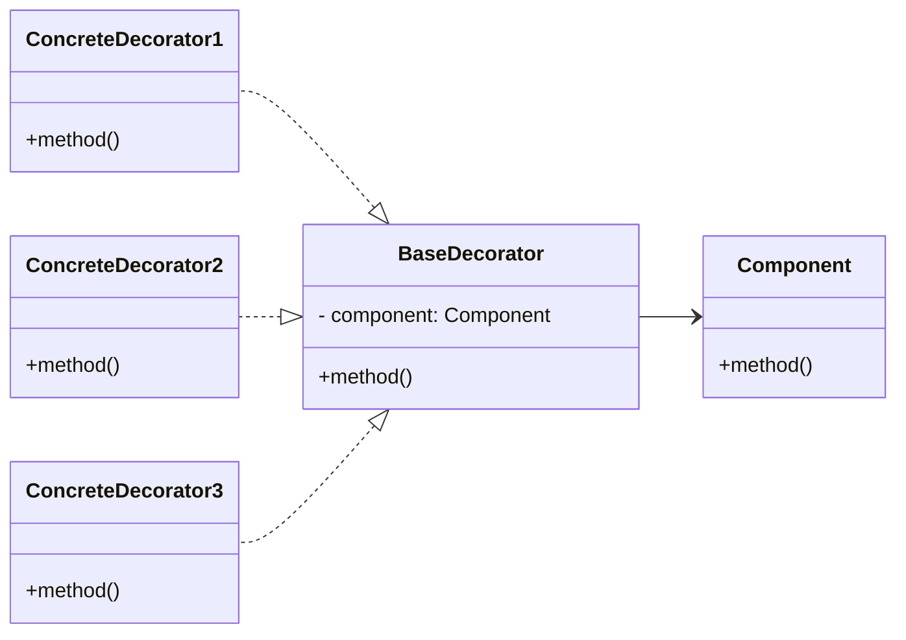

# decorator

Decorator is basically a **wrapper**. When at runtime, extra behaviors are added without changing base code.

Decorator is used when it is not possible to use inheritance. It is a Composite with only one child.

