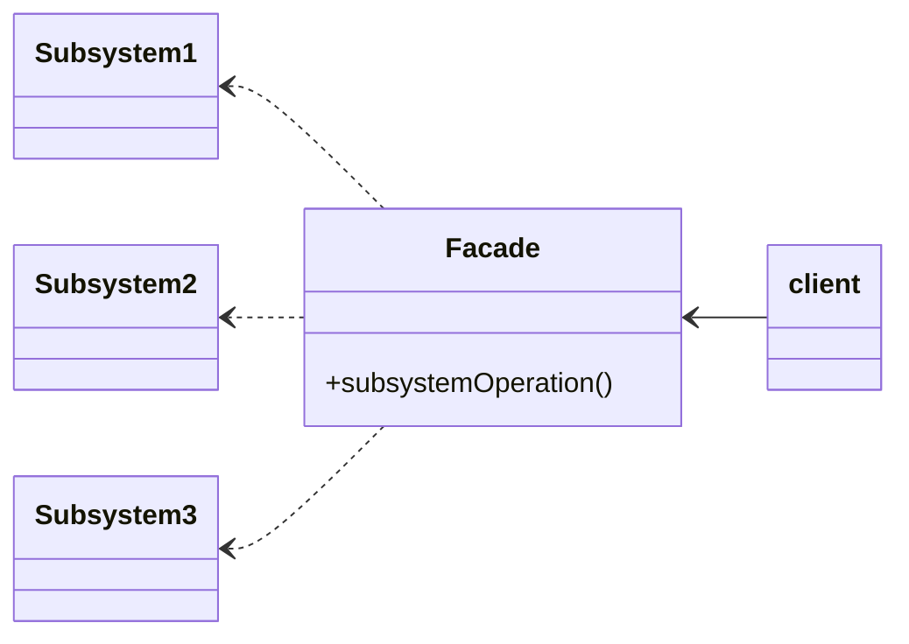

# facade

Facade provides a simple interface in front of a complex subsystem.

```mermaid
classDiagram
    direction RL
    client --> Facade
    Facade ..> Subsystem1
    Facade ..> Subsystem2
    Facade ..> Subsystem3
    class Facade{
        +subsystemOperation()
    }
```
