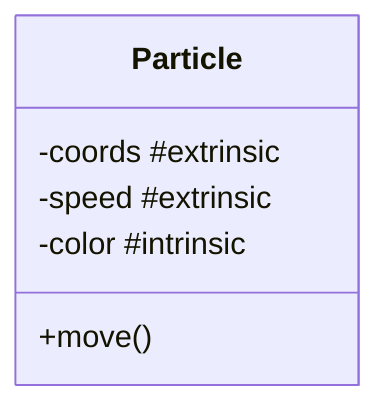
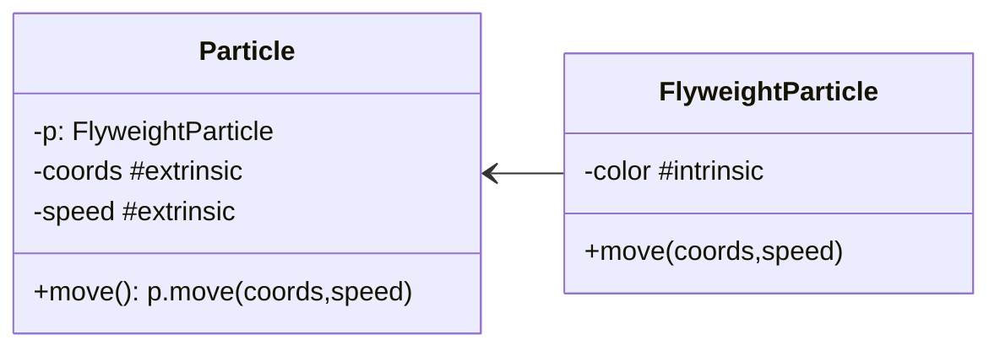

# flyweight

Flyweight objects store only **immutable intrinsic** data inside. Mutable, contextual, extrinsic data are moved outside to methods that use flyweight objects.

- original

- flyweight version

