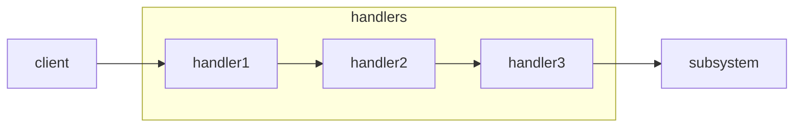

# chain of responsibility



```python
from abc import ABC, abstractmethod
from typing import *

class BaseHandler(ABC):

    @abstractmethod
    def set_next(self, base_handler):
        pass

    @abstractmethod
    def handle(self, request):
        pass

class Handler(BaseHandler):

    def __init__(self):
        self._next_handler = None

    def set_next(self, handler):
        self._next_handler = handler
        return self._next_handler

    @abstractmethod
    def handle(self, request):
        if self._next_handler is not None:
            self._next_handler.handle(request)
        return

class Handler1(Handler):
    def handle(self, request):
        if request == 1:
            print('at handler 1')
            return
        else:
            # pass down
            return super().handle(request)

class Handler2(Handler):
    def handle(self, request):
        if request == 2:
            print('at handler 2')
            return
        else:
            # pass down
            return super().handle(request)

class Handler3(Handler):
    def handle(self, request):
        if request == 3:
            print('at handler 3')
            return
        else:
            # pass down
            return super().handle(request)

def client_code():
    h1 = Handler1()
    h2 = Handler2()
    h3 = Handler3()

    h1.set_next(h2).set_next(h3)
    h1.handle(1)
    h1.handle(2)
    h1.handle(3)
    h1.handle(4)
```

| pattern      | req & res relation               |
| ------------ | -------------------------------- |
| chain of res | sequantially passing             |
| command      | unidirectional                   |
| mediator     | commute indirectly via an object |
| observer     | receivers dynamically sub/unsub  |
