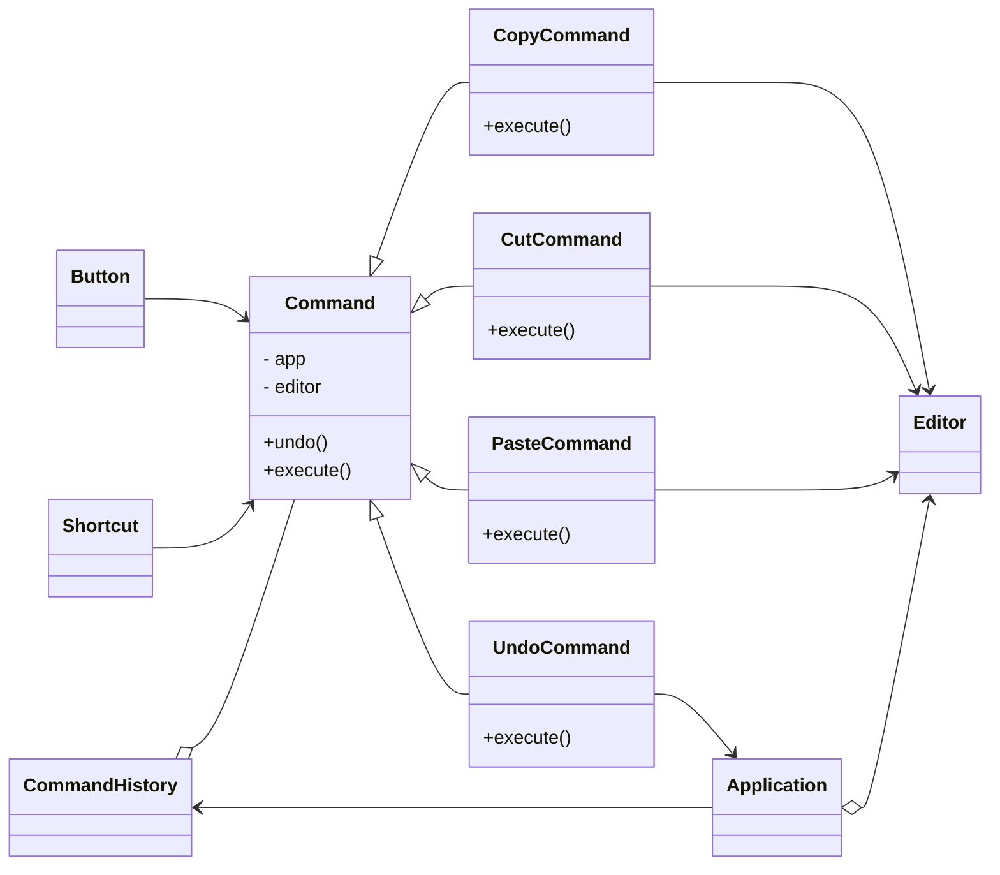

# command

Command pattern **wraps** requests into a command object, introducing a new layer between senders and receivers.

It is often used when implementing a reversable, schedulable operations.

