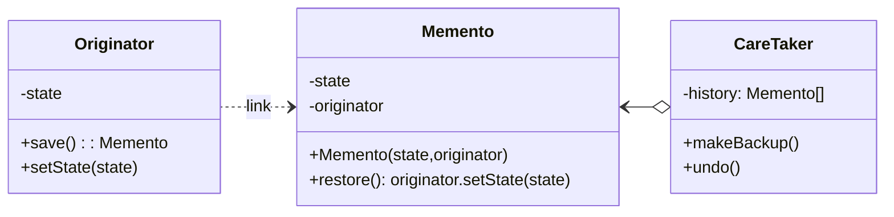

# memento

Memento pattern allows snapshot and restore previous state of an object.

```mermaid
classDiagram
    direction RL

    CareTaker o--> Memento
    Memento <.. Originator :link
    class Memento {
        -state
        -originator
        +Memento(state,originator)
        +restore(): originator.setState(state)
    }
    class CareTaker{
        -history: Memento[]
        +makeBackup()
        +undo()
    }
    class Originator{
        -state
        +save(): Memento
        +setState(state)
    }
```
