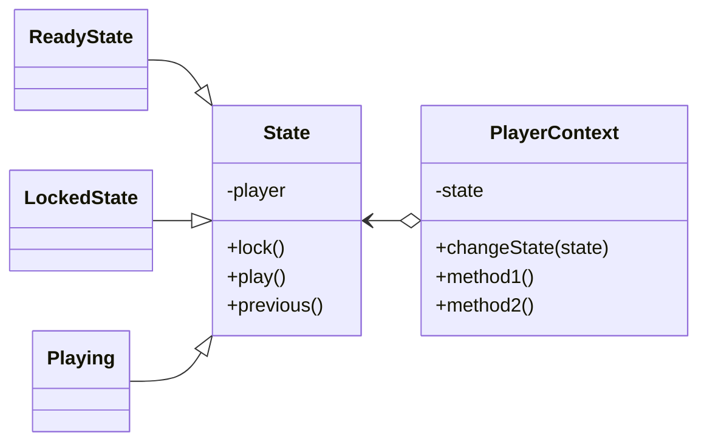

# state

Relates to Finite-State Machine.

Create a context and a separate state object to manage methods

```mermaid
classDiagram
    direction RL
    PlayerContext o--> State
    class PlayerContext{
        -state
        +changeState(state)
        +method1()
        +method2()
    }
    class State{
        -player
        +lock()
        +play()
        +previous()
    }
    State <| -- ReadyState
    State <| -- LockedState
    State <| -- Playing
```
