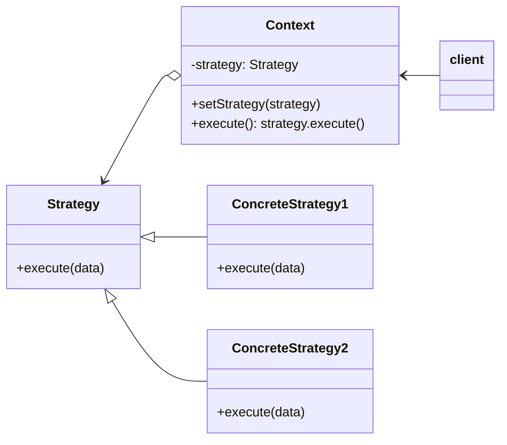

# strategy

```mermaid
classDiagram
    direction RL
    class Strategy{
        +execute(data)
    }
    class ConcreteStrategy1{
        +execute(data)
    }
    class ConcreteStrategy2{
        +execute(data)
    }
    class Context{
        -strategy: Strategy
        +setStrategy(strategy)
        +execute(): strategy.execute()
    }

    Context o--> Strategy
    ConcreteStrategy1 --|> Strategy
    ConcreteStrategy2 --|> Strategy
    client --> Context
```
