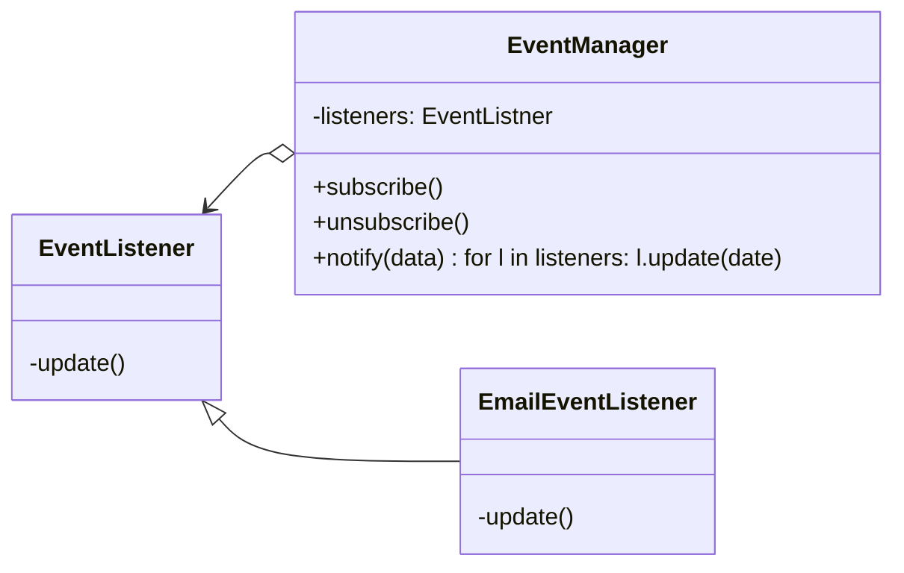

# observer

```mermaid
classDiagram
    direction RL
    EventManager o--> EventListener
    EmailEventListener --|> EventListener
    class EventManager {
        -listeners: EventListner
        +subscribe()
        +unsubscribe()
        +notify(data) : for l in listeners: l.update(date)
    }
    class EventListener{
        -update()
    }
    class EmailEventListener{
        -update()
    }

```
