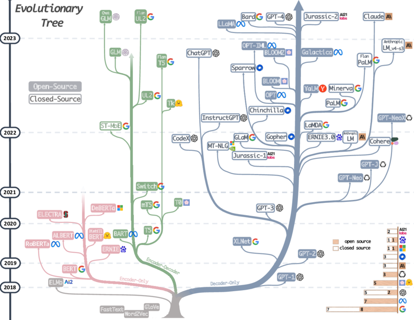

# transformer

## General

### AIGC

- [A Comprehensive Survey of AI-Generated Content (AIGC): A History of Generative AI from GAN to ChatGPT](https://arxiv.org/pdf/2303.04226.pdf)
- [Google "We Have No Moat, And Neither Does OpenAI"](https://www.semianalysis.com/p/google-we-have-no-moat-and-neither)
- A Survey of Large Language Model
  - [paper en](https://arxiv.org/pdf/2303.18223.pdf)
  - [paper cn](https://github.com/RUCAIBox/LLMSurvey/blob/main/assets/LLM_Survey_Chinese_0418.pdf)
  - [github](https://github.com/RUCAIBox/LLMSurvey)
- [Planning for AGI and beyond by Sam Altman](https://openai.com/blog/planning-for-agi-and-beyond)
- [ChatGPT 原理介绍：从语言模型走近 chatgpt](https://zhuanlan.zhihu.com/p/608047052)
- [通向 AGI 之路：大型语言模型（LLM）技术精要](https://zhuanlan.zhihu.com/p/597586623)
  - LLM 作为交互接口理解人
  - 模型大小与训练数据量关系 => 涌现
  - 分步拆解，增强了推理 CoT 能力
  - 未来 LLM 模型稀疏化
- [State of GPT](https://build.microsoft.com/en-US/sessions/db3f4859-cd30-4445-a0cd-553c3304f8e2)

### Misc

- https://github.com/microsoft/guidance

## Basic

### Transformer

- [The Illustrated Transformer](http://jalammar.github.io/illustrated-transformer/)
- [The Annotated Transformer](http://nlp.seas.harvard.edu/2018/04/03/attention.html)

### Attention

- [Attention Is All You Need](https://arxiv.org/pdf/1706.03762.pdf)
- [Visualizing A Neural Machine Translation Model (Mechanics of Seq2seq Models With Attention)](https://jalammar.github.io/visualizing-neural-machine-translation-mechanics-of-seq2seq-models-with-attention/)
- perceiver io
  - perform self-attention on latent variables, cross-attention on inputs, solve qudratic scaling of seq length
  - [paper](https://arxiv.org/pdf/2107.14795.pdf)
  - [hf doc](https://huggingface.co/docs/transformers/model_doc/perceiver)
  - [deepmind jax implementation](https://github.com/deepmind/deepmind-research/blob/master/perceiver/README.md)
  - [pytorch implementation](https://github.com/krasserm/perceiver-io)

## Rotary Position Encoding

transformer/rotary%20position%20embedding.ipynb

- [blog CN , key equation 11 and 13](https://kexue.fm/archives/8265)
- [paper, aligned with blog CN](https://arxiv.org/pdf/2104.09864v4.pdf)
- [roformer github](https://github.com/ZhuiyiTechnology/roformer)
- [blog EN from eleuther AI](https://blog.eleuther.ai/rotary-embeddings/)

## Model

### Base Model

- [The Illustrated GPT-2 (Visualizing Transformer Language Models)](https://jalammar.github.io/illustrated-gpt2/)
- [nanoGPT](<(transformer/nanoGPT.md)>)
  - [github](https://github.com/karpathy/nanoGPT)
- GPT1
  - paper [Improving Language Understanding by Generative Pre-Training](https://cdn.openai.com/research-covers/language-unsupervised/language_understanding_paper.pdf)
- GPT2
  - paper [Language Models are Unsupervised Multitask Learners](https://cdn.openai.com/research-covers/language-unsupervised/language_understanding_paper.pdf)
  - report [Release Strategies and the Social Impacts of Language Models](https://arxiv.org/pdf/1908.09203.pdf)
  - [release blog](https://openai.com/research/gpt-2-1-5b-release)
  - implementation code
    - [tf by openai](https://github.com/openai/gpt-2/blob/master/src/model.py)
    - [pytorch by huggingface](https://github.com/huggingface/transformers/blob/main/src/transformers/models/gpt2/modeling_gpt2.py)
    - [by nanoGPT](https://github.com/karpathy/nanoGPT/blob/master/model.py)
    - [by cerebras](https://github.com/Cerebras/modelzoo/tree/main/modelzoo/transformers/pytorch/gpt2)
  - GPT2 M
    - [hf](https://huggingface.co/gpt2-medium)
  - GPT2 L
    - [hf](https://huggingface.co/gpt2-large)
  - GPT2 XL
    - [hf](https://huggingface.co/gpt2-xl)
- GPT-J-6B
  - using [Mesh Transformer JAX](https://github.com/kingoflolz/mesh-transformer-jax/) trained on [the pile](https://pile.eleuther.ai/)
  - [hf](https://huggingface.co/EleutherAI/gpt-j-6b)
- GPT3
  - like GPT2 but use alternating dense and locally banded sparse attention patterns
  - paper [Language Models are Few-Shot Learners](https://arxiv.org/pdf/2005.14165.pdf)
  - [github](https://github.com/openai/gpt-3)
- CodeX / code-davinci-002
  - GPT3 family on code
  - evaluation paper [Evaluating Large Language Models Trained on Code](https://arxiv.org/pdf/2107.03374.pdf)
- GPT4
  - [blog by openai](https://openai.com/research/gpt-4)
- [LlaMa](transformer/llama.md)
  - train on roughly 1.4T tokens from public data only
  - performance
    - LLaMa-13B matches GPT3-15B
    - LLaMa-65B matches Chinchilla-70B and PaLM-540B
  - [paper](https://arxiv.org/pdf/2302.13971.pdf)
  - [facebook github](https://github.com/facebookresearch/llama)
  - [download model slowly](https://github.com/shawwn/llama-dl)
  - implementation
    - [hf](https://github.com/huggingface/transformers/blob/main/src/transformers/models/llama/modeling_llama.py)
    - [facebook](https://github.com/facebookresearch/llama/blob/main/llama/model.py)

### Supervised Fine-Tuning (SFT) Model

- Cerebras-GPT
  - gpt3 style arch with full attention, on the pile data, model size from 111M to 13B
  - [paper](https://arxiv.org/pdf/2304.03208.pdf)
  - [hf 13B](https://huggingface.co/cerebras/Cerebras-GPT-13B)
  - [code](https://github.com/Cerebras/modelzoo/blob/main/modelzoo/transformers/pytorch/gpt3/README.md) missing GPT3 implementation of banded sparse attention
- Vicuna-13B chatbot by LMSYS ORG
  - fine tune LLaMa with 70K user-shared conversations from ShareGPT
  - [blog](https://lmsys.org/blog/2023-03-30-vicuna/)
  - release delta weights on [llama](https://huggingface.co/docs/transformers/main/model_doc/llama)
  - [hf](https://huggingface.co/lmsys/vicuna-13b-delta-v1.1)
- [gpt4all](transformer/gpt4all.md)
  - fine tune gpt-j-6b with nomic-ai/gpt4all-j-prompt-generations with lora
  - [github](https://github.com/nomic-ai/gpt4all)
  - [technical report](https://static.nomic.ai/gpt4all/2023_GPT4All-J_Technical_Report_2.pdf)
- koala 13B by BAIR
  - LLaMa 13B with dialogue from open dataset
  - "the key to building strong dialogue models may lie more in curating high-quality dialogue data that is diverse in user queries, rather than simply reformatting existing datasets as questions and answers."
  - [blog](https://bair.berkeley.edu/blog/2023/04/03/koala/)
- stanford alpaca
  - fine tune the original LLaMa 7B !!!
  - on 52k instruction (alpaca_data.json) generated from text-davinci-003
  - claimed to match the performance of text-davinci-003
  - [blog](https://crfm.stanford.edu/2023/03/13/alpaca.html)
  - [github](https://github.com/tatsu-lab/stanford_alpaca/blob/main/train.py)
  - [hf weight diff](https://huggingface.co/tatsu-lab/alpaca-7b-wdiff)

### RL Model

- ChatGPT from openai
  - [sharegpt](https://shareg.pt/4qj1DB0)
- Claude from Anthropic

## Technique

### Quantization

- GPT-J-6B-8bit
  - [8bit hf model](https://huggingface.co/hivemind/gpt-j-6B-8bit)
  - [tutorial](https://github.com/sleekmike/Finetune_GPT-J_6B_8-bit/blob/master/finetune_gpt_j_6B_8bit.ipynb)
  - [perplexity](https://nbviewer.org/urls/huggingface.co/hivemind/gpt-j-6B-8bit/raw/main/check_perplexity.ipynb)

### Safety

- [Red Teaming Language Models to Reduce Harms: Methods, Scaling Behaviors, and Lessons Learned](https://arxiv.org/pdf/2209.07858.pdf)

### Fine Tuning

- PEFT
  - Parameter-efficient fine-tuning of large-scale pre-trained language models
  - Towards a unified view of parameter-efficient transfer learning
  - [github](https://github.com/huggingface/peft)
  - LoRA
    - [paper](https://arxiv.org/pdf/2106.09685.pdf)
    - [github](https://github.com/microsoft/LoRA)
    - alpaca lora
      - [github](https://github.com/tloen/alpaca-lora)
      - [hf weights](https://huggingface.co/tloen/alpaca-lora-7b)
- instruction learning / zero shot
  - [awesome](https://github.com/RenzeLou/awesome-instruction-learning)
  - [Is Prompt All You Need? No. A Comprehensive and Broader View of Instruction Learning](https://arxiv.org/pdf/2303.10475.pdf)
  - self-instruct
    - grow instruction pair size with openai api
    - [paper](https://arxiv.org/pdf/2212.10560.pdf)
    - [github](https://github.com/yizhongw/self-instruct)

### Scaling / Emergent Behaviour

- [大语言模型的涌现能力：现象与解释](https://zhuanlan.zhihu.com/p/621438653)
- [paper Emergent Abilities of Large Language Models](https://arxiv.org/pdf/2206.07682.pdf)
- Chinchilla 7B
  - compute-optimal model, haiku on TPU
  - evaluate the trade off of model size and number of training tokens, given fixed flop budget
  - [paper](https://arxiv.org/pdf/2203.15556.pdf)
