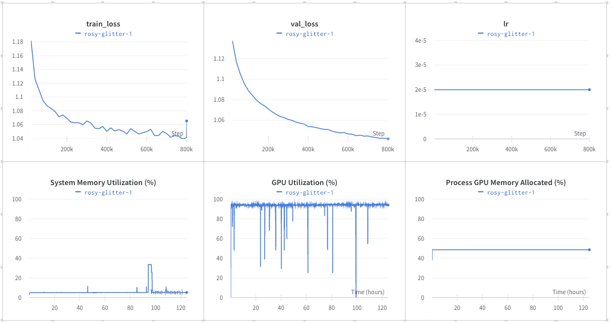

# gpt4all

fine tune a [gpt-j-6B](https://huggingface.co/EleutherAI/gpt-j-6b) model with dataset [nomic-ai/gpt4all-j-prompt-generations](https://huggingface.co/datasets/nomic-ai/gpt4all-j-prompt-generations)

[source code](https://github.com/wzy816/gpt4all/tree/train)

124.67 hour, single A100 80GB card, result https://wandb.ai/wzy816/gpt4all_gptj_lora_20230515



## training

```bash
# change env
export TRANSFORMERS_CACHE=/mnt/huggingface/hub
export HF_DATASETS_CACHE=/mnt/huggingface/datasets
export TRANSFORMERS_NO_ADVISORY_WARNINGS="true"

# install c++ 8
yum install centos-release-scl
yum install devtoolset-8-gcc devtoolset-8-gcc-c++
scl enable devtoolset-8 -- bash
which c++

# install git lfs
yum install git-lfs

# download dataset
git clone https://huggingface.co/datasets/nomic-ai/gpt4all-j-prompt-generations/
cd gpt4all-j-prompt-generations
git lfs pull

# clone repo
cd ..
# git clone --recurse-submodules https://github.com/nomic-ai/gpt4all.git
git clone  --recurse-submodules git@github.com:wzy816/gpt4all.git
cd gpt4all
git co train
git submodule update --init

conda create -n gpt4all python=3.9
conda activate gpt4fall

# modify finetune_gptj_lora yaml
# add dataset_version in train.py

# on train branch
accelerate launch --dynamo_backend=inductor --num_processes=1 --num_machines=1 --machine_rank=0 --deepspeed_multinode_launcher standard --mixed_precision=bf16  --use_deepspeed --deepspeed_config_file=configs/deepspeed/ds_config_gptj_lora.json train.py --config configs/train/finetune_gptj_lora_20230515.yaml

# app branch
cd app
streamlit run app.py

```
